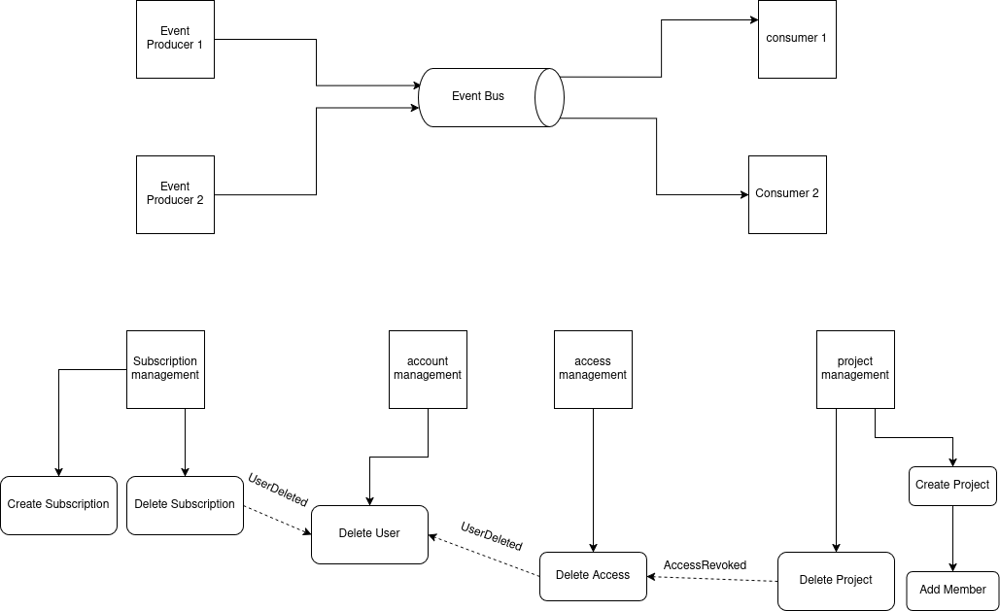

# Event-Driven Architecture Documentation

## Overview

This project implements an Event-Driven Architecture (EDA) utilizing Kafka as the event bus. Services communicate asynchronously by publishing and consuming events, promoting loose coupling and scalability. A shared repository (`shared`) provides common configurations, interfaces, and third-party integrations.

## Architecture Components

### 1. Event Bus (Kafka)

* **Central Messaging System**: Kafka serves as the backbone for asynchronous communication.
* **Event Producers**: Services that publish events to Kafka topics.
* **Event Consumers**: Services that subscribe to topics and process events.

### 2. Services

* **Subscription Management**: Manages subscription creation and deletion.
* **Account Management**: Handles user account operations, such as user deletion.
* **Access Management**: Manages access rights, including revoking access.
* **Project Management**: Oversees project creation, deletion, and membership.

### 3. Shared Repository (`shared`)

* **Common Configurations**: Includes Kafka settings and other shared configurations.
* **Shared Interfaces**: Defines event schemas and other interfaces used across services.
* **Third-Party Integration Utilities**: Provides utilities for logging, monitoring, and other integrations.

### 4. Events

* **UserDeleted**: Published when a user is deleted.
* **AccessRevoked**: Published when access is revoked.

## Communication Flow

Services communicate via Kafka events, not directly. For example:

1. **Account Management** publishes a `UserDeleted` event when a user is deleted.
2. **Subscription Management** consumes the `UserDeleted` event and triggers subscription deletion.
3. **Access Management** consumes the `UserDeleted` event and revokes access.
4. **Access Management** publishes an `AccessRevoked` event.
5. **Project Management** consumes the `AccessRevoked` event and updates project memberships.

## Service Responsibilities

* **Subscription Management**: Listens for `UserDeleted` events to delete subscriptions.
* **Account Management**: Publishes `UserDeleted` events upon user deletion.
* **Access Management**: Listens for `UserDeleted` events to revoke access and publishes `AccessRevoked` events.
* **Project Management**: Listens for `AccessRevoked` events to update projects.

## Shared Repository Usage

Services utilize the `shared` repository for:

* **Kafka Configurations**: Ensuring consistent Kafka settings across services.
* **Event Schemas**: Defining and sharing event schemas to maintain consistency.
* **Third-Party Integrations**: Utilizing shared utilities for logging, monitoring, and other integrations.

## Benefits

* **Decoupling**: Services operate independently, reducing dependencies.
* **Scalability**: Kafka supports scaling producers and consumers.
* **Resilience**: Asynchronous communication enhances fault tolerance.
* **Consistency**: Shared repository ensures uniform configurations and interfaces.

This documentation provides an overview of the Event-Driven Architecture implemented in the project, detailing the components, communication flow, and the use of the Decorator Pattern for logging and Unit of Work functionalities.

## Architecture Diagram

